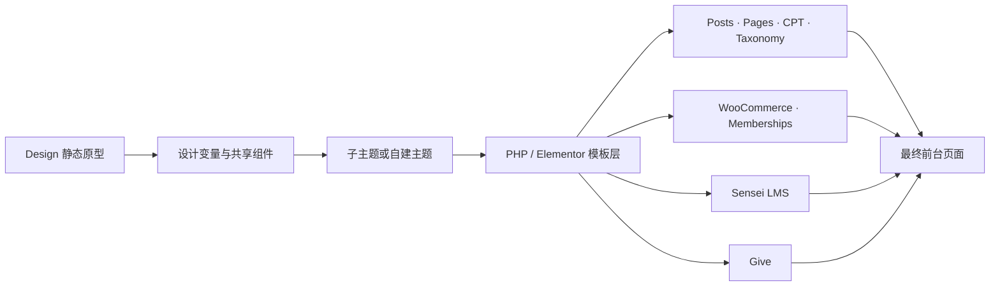
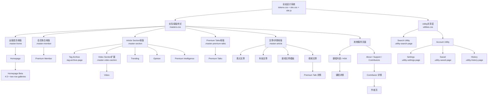

# 关键页面映射

更新日期：2026-09-11

## 维护规则

`MAP.md` 是设计文件、线上网址与 WordPress 实现之间的唯一对应表。以后每次新增、重做或合并关键页面时，必须在同一次任务中同步更新：

1. 源网址和设计文件路径。
2. 本轮 UI 改动摘要。
3. WordPress 请求类型、建议模板、数据来源和插件依赖。
4. 实现状态：`拟定`、`已确认`、`已接入`、`已验收`。
5. 本页顶部的更新日期。`TODO.md` 不属于网页修改工作流，除非用户明确点名，否则不得读取或修改。

页面数量口径：下表保留原来的 18 个源站编号组，但 `2a/2b` 与 `4a/4b/4c` 分别代表独立网址；再加通用 Tag Archive，当前共有 **22 个正式 HTML 页面**。

### 母版与样式继承规则

母版现在是实际存在、会被浏览器加载的样式层，不是只写在文档里的抽象特征。每个页面依次加载：

1. `css/tokens.css`：颜色、字体、间距和阅读宽度等设计变量。
2. `css/site.css`：导航、页脚、按钮、基础卡片、弹窗等全站组件。
3. `css/masters.css`：页面家族母版；`.master-home` 管理首页封面、栏目封面、画廊和悬浮导语，`.master-member` 管理会员主张与三组普通内容卡片，`.master-article` 管理文章标题区、作者、正文和图片渲染，`.master-section`／`.master-video-section` 管理文章、Tag Archive 与视频栏目看板，`.master-premium-talks` 管理逐行会员视频卡片。
4. `css/utilities.css`：Utility 共享层，并明确拆分 Account Utility（`.utility-settings-page`、`.utility-saved-page`、`.utility-history-page`）与 Search Utility（`.utility-search-page`）两种母版；二者共享视觉令牌和全站壳层，但不强行共享业务布局。

具有全局性的调整必须写入上述共享层。例如，文章正文图片的宽度、灰度/彩色模式和图注统一在 `masters.css` 的 `.master-article .wp-source-content` 规则中修改；不得只在某篇文章里复制一份样式。仅属于单页内容差异的结构或标签可以留在 HTML。若确需单页覆盖，必须在此处记录原因和作用范围。

在拿到服务器主题、数据库结构和 Elementor 模板导出前，下表中的 WordPress 文件名属于**实现建议**，不能视为已经确认的服务器结构。禁止直接修改父主题 `aardvark`、插件目录或 `wp-content/uploads/`；正式代码应进入子主题、自建主题或独立功能插件。

| # | 源网址 | 对应文件 | 本轮重新设计 |
|---|---|---|---|
| 1 | https://thechinaacademy.org/ | `Homepage/index.html` | **首页设计已完成并作为当前视觉基线。** Continue Exploring 的四门课程使用严格等宽 `16:9` 封面；`820px` 以下 Most-read 独立为第三屏，覆盖约 `690–778px` 的窄平板宽度。主推荐保持 10 秒自动轮播；注册提醒使用同一底部色面的伸缩切换；Footer 桌面三列等宽并含 Partners／HSK，手机末端保留可滚动安全余量 |
| 2a | https://thechinaacademy.org/trending/ | `Article Sections/trending.html` | 继承 `.master-section`：低留白金色斜体标题（无右侧横线）、`All + 六项主题` 横向主题条、Latest／Popular 排序和满行卡片；lede 使用 `xx min read/watch`，All 首行后插入每条带图片的米白色 `Editor's Picks`，`LOAD MORE` 展开后续卡片 |
| 2b | https://thechinaacademy.org/thinkersforum/ | `Article Sections/thinkers-forum.html` | 页面展示名为 Opinion，保留源网址和文件路径；继承 `.master-section` 的 All／主题与排序逻辑，并在 All 首行后以带图片的米白色 `Editor's Picks` 呈现源站 China–Japan 示例内容 |
| 3 | https://thechinaacademy.org/video/ | `Video Sections/video.html` | 继承 Article Section 的四／三／二／一列看板但不显示 Editor's Picks；标题下为 `All + 11 个源站视频栏目`，每个栏目状态均提供 Latest／Popular。导航使用 `?channel=` 激活栏目，卡片统一为 `16:9`、视频主题标签、lede 与 `xx min watch`；仅标题栏分割线为金色，内容分割线为全局中性色 |
| 4a | https://thechinaacademy.org/how-is-pakistan-helping-china-to-reunify-taiwan-island-2/ | `Videos/video-article.html` | 真实 16:9 Cloudflare 播放器；源站标题、日期与导语；复用文章主题标签、收藏、左右导轨、相关推荐、分享和评论体系 |
| 4b | https://thechinaacademy.org/how-mao-zedong-led-china-to-break-though-the-us-blockade/ | `Articles/article-featured-image.html` | 头图固定为页面内容宽和 `16:9`；标题以 `80px` 为上限按换行和可用高度自适应。藏青蒙版保留日期、标题和完整作者信息，不再显示红色主题标签；图下 lede 与正文同字号，时长标签服从全局同色填充规则。移动评论区与正文同宽；作者弹窗支持无内容关闭、cookie 草稿、段内 Learn more 和深藏青输入框 |
| 4c | https://thechinaacademy.org/from-tiktok-to-rednote-the-dialectical-transition-into-opposites/ | `Articles/article-text.html` | 文字文章变体：标题区不再显示主题标签，日期、标题、作者与 lede 居中；正文继承与头图版相同的目录、双组推荐、Editor、分享、评论和作者联系弹窗 |
| 5 | https://thechinaacademy.org/premium-member/ | `Homepage/premium-member.html` | 重新抓取源页会员主张与 12 条内容；`$10 MONTHLY`、权益说明和 CTA 置于亮米白区块；Intelligence、Courses 继承非推荐栏目结构。Talks 封面及三张卡片进一步统一首页视频语言：`16:9`、红色标签前播放三角、无图中央播放字符、lede 和 `xx min watch` |
| 6 | https://thechinaacademy.org/courses-2/ | `About/premium-courses.html` | 继承 `.master-section` 的金色标题与内容分类栏；删除价格／会员 Banner，只在分类栏下保留一个会员入口。九门课程保留源站左右人物构图和桌面／移动专用封面，桌面 hover／focus 切换源站详情，移动端把详情置于封面下方 |
| 7 | https://thechinaacademy.org/lesson/making-the-world-anew-bandung-spirit-and-the-de-dependency-development-of-china/ | `Videos/lesson.html` | 16:9 课程主视觉、源站课程介绍与殷之光讲师信息；单课课纲、进度、可持久化完成状态及源站相关推荐 |
| 8 | https://thechinaacademy.org/?s=y | `Utility/search.html` | 独立 Search Utility：金色斜体栏目标题、底线查询框和 SVG 搜索图标；保留结果数量、Article／Author、Load More 与 Article 的 Latest／Popular。查询匹配六项 taxonomy 时显示 Topic 入口。固定四项 Editor’s Picks 与页面同背景，桌面按实时 Header 高度粘附并在剩余视口内滚动，移动端回到主结果之后并复用 Trending 分割线 |
| 9 | https://thechinaacademy.org/premium-intelligence/ | `Article Sections/premium-intelligence.html` | 继承 `.master-section`：横向 Intelligence 主题条、带 Premium 状态的分割线卡片看板及 `LOAD MORE`；不插入 Editor's Picks |
| 10 | https://thechinaacademy.org/premium-talks/ | `Video Sections/premium-talks.html` | 删除栏目筛选、价格／介绍／会员 CTA 和追加内容流，改为逐行长卡：左侧 `16:9` 金底白字 Premium 封面，右侧主题、标题、以 EB 粗体嘉宾名开头的 lede 与 `xx min watch`；内容锚定源站 8 条 Premium Talks |
| 11 | https://thechinaacademy.org/how-china-builds-the-worlds-tallest-bridge/ | `Videos/premium-talk-detail.html` | 真实 16:9 Cloudflare 播放器和金底白字 Premium 标识；源站标题、日期、导语及张维为讲师信息；复用收藏、推荐、评论并保留清晰会员边界 |
| 12 | https://thechinaacademy.org/hsk-certified-courses/ | `About/hsk.html` | 按 HSK 能力阶段组织的语言学习路径 |
| 13 | https://thechinaacademy.org/about-us/ | `About/about.html` | 使命声明、工作方法和明确组织入口 |
| 14 | https://thechinaacademy.org/support-us/ | `About/support.html` | 支持影响说明、一次性/持续/机构三类路径 |
| 15 | https://thechinaacademy.org/contributors-2/ | `About/contributors.html` | 删除虚构专业领域筛选，使用源站人物姓名／职务和圆形作者组件组成高密度人物看板；桌面头像按鼠标距离缩放并同步下方身份带，移动端为三列稳定触控网格 |
| 16 | https://thechinaacademy.org/contributors_zhang-weiwei/ | `About/contributor-detail.html?name=zhang-weiwei` | 源站人物身份、简介、Featured Works、Experiences 与 Recent Events；Contact 复用全站作者弹窗并隐藏 Learn More |
| 17 | https://thechinaacademy.org/column_zhang-weiwei/ | `About/author.html?name=zhang-weiwei` | 紧凑人物头部与 All／Article／Video 看板；与 Contributor Details 的 Recent Events 共用同一作品数据、卡片、筛选和 Load More |
| 18 | https://thechinaacademy.org/setting/ | `Utility/setting.html` | Account Utility 设置页：删除冗余页首、面板标题和原生文件名；默认 Premium Profile 显示金底白字标签。Username 与 Country / Region 保持字段级 `EDIT → SAVE · CANCEL`，所有输入保留聚焦金色底线并以 `#EBE4D7` 填充激活背景，密码 Show／Hide 位于右上且空值禁用；三页二级入口统一为 Roboto 灰底状态，移动端 workbench 无顶部 padding、二级导航无下分割线 |
| 19 | `/tag/{term}/` | `Utility/tag.html?name={term}` | 通用主题归档：标题直接显示当前主题名，在同一四／三／二／一列看板中混合文章与视频，保留 Latest／Popular 和 Load More，不显示主题导航栏或 Editor’s Picks |

### 非关键网址模板与实验入口

| 用途 | 文件 | 作用范围 |
|---|---|---|
| 新闻文章模板 | `Articles/article-news.html` | 参考 Chang’e-6 源页：日期／标题居中、左侧简报导航、正文、带导语的右侧推荐、一行 Editor、圆形分享与评论；相邻新闻的章末—分割线与分割线—下章标题留白均为 `1.15em`；这是模板演示，不计入 21 个关键网址 |
| 首页 Beta | `Beta Demo/homepage.html` | 加载 `Homepage/index.html?demo=beta-4x3`；桌面非视频封面切换为 `4:3`、视频保持 `16:9`，普通文章画廊使用两行和 `246px` 卡片（较原版缩小四分之一），不影响正式首页 |
| 跨平台讨论 Beta | `Beta Demo/discussions-across-platforms-demo.html` | 完整文章 mock 下依次呈现 Discussions Across Platforms 与 Comments；Version B 使用无卡片单列 comment stream，精选流上方放 LinkedIn／Reddit／Facebook 主题色阴纹启动行，YouTube 以 SVG 播放符号呈现，并保留同构的本站评论与输入区 |

### 账户辅助页面

| 源网址／功能 | 对应文件 | 本轮重新设计 |
|---|---|---|
| https://thechinaacademy.org/collect | `Utility/settings-saved.html` | 左侧收藏夹支持 Create／Rename／Delete；右侧示例内容支持 Select all／Unfavorite／Move to／Copy to，移动端收藏夹以统一二级标签样式移到内容上方；批量操作区下分割线为灰色 |
| https://thechinaacademy.org/history-2 | `Utility/settings-history.html` | All／Article／Video 复用统一二级标签、本页筛选、紧凑浏览记录、单条 Delete 与当前筛选范围的 Delete all；工具栏下分割线为灰色 |

## WordPress 实现映射

### 本轮全站共享行为

- `js/site.js` 生成双层桌面导航：功能栏为 Support Us、About Us、普通浅色搜索和金色演示登录；标题栏为 Home、Trending、Opinion、品牌、Video、Premium、Not Just Travel。HSK 页面仍保留，但不再占用主导航入口。
- Video 与 Premium 使用共享下拉菜单；桌面标题本身分别连接 Video Archive 与 Premium Member，Video 子项使用 `video.html?channel=...`。移动端把标题链接和展开按钮拆开但保持同一个 `48px` 行盒，二级项目继续按两行横向滑动；全屏菜单仍为独立 `100dvh` 滚动容器并锁定背景页面。
- 全站内容最大宽度由 `tokens.css` 的 `--max:1600px` 控制；界面无衬线统一为本地 Roboto 可变字体。`masters.css` 的最终排版护栏把所有文本行高限制在 `1.2–1.5`。
- 除文章母版与 Article Section 母版外的非首页页面由共享脚本追加六个紧凑内容入口；Article Section 使用自身卡片看板，文章页只使用自身的 Continue Exploring／Related Reading，禁止重复追加内容流。
- 桌面非视频封面文章图片采用 `1:1`，视频封面和全部普通文章图片采用 `16:9`。主推荐标题动态缩放且不超过 `80px`，主推荐 lede 固定为 `30px`；非推荐栏目封面的主题标签、标题和默认 `20px` lede 连续排列、整体垂直居中，标题与 lede 之间固定一倍 lede 行距。仅在发生溢出时依次缩小 lede 与标题；约 `930px` 后移动端封面回落为 `16:9`。
- 主题标签只允许使用 `China’s Economy & Business`、`China’s Politics`、`U.S.`、`China’s Technology`、`China’s Youth Sentiment`、`China’s Worldview` 六项，并统一链接到 `Utility/tag.html?name=...`；共享 `site.js` 负责把旧页面标签统一归类、重写 Tag Archive 参数及重建 Article Section 的横向主题栏。顶部主题栏继续在栏目页本地切换，卡片主题标签进入 Tag Archive，悬浮仍切换为 `MORE >>`。正式 WordPress 实现应建立同名 taxonomy terms，并在数据迁移阶段完成旧 term 映射。
- 首页图片全部改为非链接容器，标题、lede 及 lede 行末的时长标签可进入文章。共享 `.lede-row` 把可点击的 `xx min read/watch` 圆角标签内联在导语末尾；鼠标进入整个 lede 后，方框以自身当前文字色填充并切换为纸色文字，因此所有页面都能随组件颜色同步。阅读时长仍按英文词数除以 `220` 后向上取整。
- 功能栏与标题栏缩小由同一个滚动状态驱动：`3px` 噪声过滤、向下 `30px`／向上 `36px` 的方向累计和切换后的 `560ms` 锁避免状态反转；`overflow-anchor:none` 防止 Header 动画参与浏览器滚动锚定。功能栏在 `280ms` 内收回，同时标题栏从 `82px` 缩到 `58px`、品牌同步缩小。演示登录同时写入当前浏览器会话的注册状态；正式 WordPress 合并时须替换为 WordPress/WooCommerce 登录状态和账户链接。
- 首页未注册会话进入页面即打开无遮罩的贴底窗口；窗口和 `36px` 横幅共用同一底部色面，`site.js` 测量窗口内容高度，CSS 在 `520ms` 内直接改变外层高度，同时交叉淡化两套内容，不再串行收回／弹出。三列窗口的理论宽度临界点约为 `847px`；`601–860px` 隐藏说明列并为关闭按钮预留空间。Footer 进入视口后当前提示向下收回，离开后恢复；移动端层级低于全屏导航。正式实现应由真实登录／注册状态驱动。
- 当前页面的 viewport 均启用 `viewport-fit=cover`；共享脚本以白色为默认浏览器主题色，移动全屏菜单打开时同步切为藏青色，使 iPhone 刘海安全区与其下方区域一致。
- Settings／Saved／History 的页内二级入口统一为 `.utility-secondary-nav` 与 Roboto：桌面选中／悬浮使用 `--paper-2` 灰底，移动端使用无分割线的灰色方框状态，workbench 顶部 padding 为 `0`。Saved／History 批量工具栏下线使用 `--line`；所有文字型 input 和 textarea 聚焦时统一填充 `#EBE4D7` 并使用蓝色文字。
- `.master-article` 现在有头图、文字、新闻三种标题区变体；三者标题区均不显示红色主题标签，并共用作者卡、彩色正文图片、对齐首段的首字下沉、左栏导航、Editor、分享、评论和作者联系弹窗。所有正文图片统一使用 `width:100%; max-width:100%; height:auto` 与正文等宽；大章节 `h2` 使用粗体和 `28.5ch` 最大宽度，编号小节 `h3` 使用常规字重。新闻条目清除末项默认 margin，使分割线上下严格对称为 `1.15em`。
- `js/site.js` 生成的全站 Footer 复用源站官方图标并删除旧宣传句；桌面 About、Follow Us、More 为三个等宽列。About 末尾的 Partners 使用 `
`，悬浮、聚焦或点击时平滑展开 Roboto 字体的伙伴列表，当前 HSK 链接到正式课程页。其余平台、账号、邮件和政策规则保持不变。
- `.master-section` 统一 Trending、Opinion 与 Premium Intelligence；`.master-video-section` 复用卡片几何但隔离文章 taxonomy。Video Archive 使用四／三／二／一列、All＋11 个节目栏目、Latest／Popular 与 `?channel=` 状态，不插入 Editor's Picks；Premium Talks 另用 `.master-premium-talks` 的逐行长卡母版。
- 视频内容以 `data-content-type="video"`、视频页面或 Talks 栏目识别；首页图片中央不呈现播放按钮，所有视频内容改为在红色主题标签前显示留有间距的小型红色播放三角，时长显示 `xx min watch`。主推荐画廊每 10 秒自动前进，圆点用扇形显示进度；播放／暂停控制器不使用字符或圆形底纹，改在 `10px × 10px` 盒中用 CSS 双竖线／三角形绘制并与圆点中心对齐，控制器外边距固定为 `0`。
- 三个 Video Detail 页的播放信息与分享入口合并为以主视频左右边缘为锚点的响应式行：宽度足够时两端对齐，宽度不足时换为两行并左对齐；播放信息上下内边距均为 `11px`，分享图标高度为 `20px`。Lesson 的 Course Plan 进度仅作原型展示，由鼠标在页面中的水平位置正向映射；未完成时灰色进度逐渐填充无色背景，完成后平滑转为金色，不模拟或保存真实播放进度。
- `js/about.js` 管理四个 About 内容页面：Courses 使用源站九门课程与 art-directed 封面；Contributors 使用源站人物名录和距离响应头像看板；Zhang Weiwei 的 Contributor Details 与 Column 共用同一份十项作品目录。全站 `.author-dialog` 由 `site.js` 单例管理，Contributor／Column 调用不显示 Learn More，文章作者仅在具有真实 Column 地址时显示。

当前源站可见技术基线：Aardvark 主题、Elementor/Elementor Pro、WooCommerce、WooCommerce Memberships、订阅功能、Sensei LMS 与 Give。最终采用“现有主题子主题”还是“自建主题”，须在取得服务器代码与后台导出后决定。

| # | 页面 / 请求类型 | 建议 WordPress 实现 | 主要数据或依赖 | 状态 |
|---|---|---|---|---|
| 1 | Front Page | `front-page.php`，或 Elementor Theme Builder 的 Front Page 模板 | 置顶文章、栏目查询、会员推广位 | 拟定 |
| 2a | Trending 页面或内容归档 | 优先评估 `archive.php`、`category.php` 或专用 Page Template；若继续使用 Elementor，则建立对应 Archive/Page 模板 | Posts、Category/Taxonomy、置顶内容 | 拟定 |
| 2b | Opinion 页面或内容归档 | `archive-thinkers.php`、自定义 taxonomy archive，或 Elementor Archive 模板 | 文章、作者、议题 taxonomy | 拟定 |
| 3 | Video Archive | `archive-video.php`，或视频 CPT/栏目归档模板 | Video CPT、系列 taxonomy、时长、YouTube ID | 拟定 |
| 4a | Video Single | `single-video.php` 或视频文章专用模板 | 播放器、文字稿、嘉宾、章节、相关阅读 | 拟定 |
| 4b | Opinion Post Single | `single.php` / `single-post.php`，通过分类或 block pattern 呈现观点文章变体 | Post、作者、正文、引文、参考资料 | 拟定 |
| 4c | Technology Post Single | 与普通文章共享 `single.php`，通过 taxonomy、字段和 block style 产生科技变体 | Post、技术主题 taxonomy、术语/资料字段 | 拟定 |
| 5 | Membership Landing Page | 专用 Page Template 或 Elementor Page 模板；权限和购买仍由 WooCommerce Memberships/Subscriptions 接管 | 会员方案、产品、结账、登录状态 | 拟定 |
| 6 | Course Archive | 优先沿用 Sensei LMS 课程归档并通过 hooks/可覆盖模板调整，避免复制课程业务逻辑 | Sensei Course、分类、课时、学习进度 | 拟定 |
| 7 | Lesson Single | 沿用 Sensei LMS Lesson 模板、hooks 与权限判断，再套用课程详情 UI | Sensei Lesson、视频、课纲、完成状态 | 拟定 |
| 8 | Search Results | `search.php`；如需跨文章、视频、课程和作者搜索，增加定制查询或搜索服务 | `WP_Query`、CPT、taxonomy、分页 | 拟定 |
| 9 | Premium Intelligence Archive | Intelligence CPT 的 `archive-intelligence.php`，或会员受限 Page/Archive 模板 | Intelligence CPT、主题、会员权限 | 拟定 |
| 10 | Premium Talks Archive | `archive-premium_talk.php` 或 Elementor Archive 模板 | Premium Talk CPT、系列、会员权限 | 拟定 |
| 11 | Premium Talk Single | `single-premium_talk.php`；展示公开预览，正文和播放由会员权限控制 | Talk CPT、播放器、章节、会员状态 | 拟定 |
| 12 | HSK Landing / Course Archive | HSK 专用 Page Template，加 Sensei Course 查询；不要另建一套课程进度系统 | Sensei Course、HSK Level taxonomy | 拟定 |
| 13 | About Page | `page-about-us.php` 或通用 Page Template + 可编辑 patterns/Elementor sections | Page 内容、组织信息 | 拟定 |
| 14 | Support Page | 专用 Page Template；捐赠表单与支付交给 Give | Give Form、金额、支付和回执状态 | 拟定 |
| 15 | Contributor Archive | Contributor CPT 的 `archive-contributor.php` | Contributor CPT、姓名、职务、头像或由姓名生成的 initials | 拟定 |
| 16 | Contributor Single | `single-contributor.php`，展示简介与精选内容 | Contributor 字段、关联作者/文章/视频 | 拟定 |
| 17 | Author Archive | `author.php`；若 Contributor 与 WP User 分离，建立明确关联字段 | WP User、Posts、Video/Talk 关联查询 | 拟定 |
| 18 | Account / Settings | 优先定制 WooCommerce My Account 或会员账户端点，不另造账户数据库 | 用户资料、Membership、订单、收藏、课程进度 | 拟定 |
| 19 | Topic Term Archive | `taxonomy-topic.php` 或对应自定义 taxonomy archive 模板 | 六项 topic terms、文章与 Video CPT 混合查询、分页、排序 | 拟定 |

### 设计文件到 WordPress 的关系

## 页面继承关系

