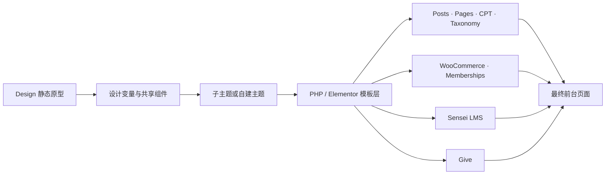
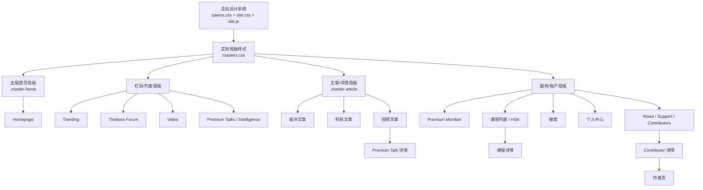

# 关键页面映射

更新日期：2026-08-20

## 维护规则

`MAP.md` 是设计文件、线上网址与 WordPress 实现之间的唯一对应表。以后每次新增、重做或合并关键页面时，必须在同一次任务中同步更新：

1. 源网址和设计文件路径。
2. 本轮 UI 改动摘要。
3. WordPress 请求类型、建议模板、数据来源和插件依赖。
4. 实现状态：`拟定`、`已确认`、`已接入`、`已验收`。
5. 本页顶部的更新日期，并在 `TODO.md` 更新相关任务状态。

### 母版与样式继承规则

母版现在是实际存在、会被浏览器加载的样式层，不是只写在文档里的抽象特征。每个页面依次加载：

1. `css/tokens.css`：颜色、字体、间距和阅读宽度等设计变量。
2. `css/site.css`：导航、页脚、按钮、基础卡片、弹窗等全站组件。
3. `css/masters.css`：页面家族母版；`.master-home` 管理首页封面、栏目封面、画廊和悬浮导语，`.master-article` 管理文章标题区、作者、正文和图片渲染。

具有全局性的调整必须写入上述共享层。例如，文章正文图片的宽度、灰度/彩色模式和图注统一在 `masters.css` 的 `.master-article .wp-source-content` 规则中修改；不得只在某篇文章里复制一份样式。仅属于单页内容差异的结构或标签可以留在 HTML。若确需单页覆盖，必须在此处记录原因和作用范围。

在拿到服务器主题、数据库结构和 Elementor 模板导出前，下表中的 WordPress 文件名属于**实现建议**，不能视为已经确认的服务器结构。禁止直接修改父主题 `aardvark`、插件目录或 `wp-content/uploads/`；正式代码应进入子主题、自建主题或独立功能插件。

| # | 源网址 | 对应文件 | 本轮重新设计 |
|---|---|---|---|
| 1 | https://thechinaacademy.org/ | `Homepage/index.html` | 无标题的两屏主要推荐画廊 + Trending / Thinkers Forum / Premium / Video；桌面封面图为 `1:1`，主推荐左图右文、栏目封面左文右图；导语先在标题字号 `60%→50%` 范围内自适应，再调整标题/导语间距以贴齐图片底边；约 `930px` 后切换为 `16:9` 单栏 |
| 2a | https://thechinaacademy.org/trending/ | `Sections/trending.html` | 主题筛选、主推报道、编辑型三列列表 |
| 2b | https://thechinaacademy.org/thinkersforum/ | `Sections/thinkers-forum.html` | 深色思想论坛开场、长论述主推、议题卡片 |
| 3 | https://thechinaacademy.org/video/ | `Sections/video.html` | 系列筛选、时长标签、主视频与节目卡片 |
| 4a | https://thechinaacademy.org/after-the-earthquake-why-reconstruction-is-the-real-challenge-for-the-global-south/ | `Articles/video-article.html` | 大播放器、章节/文字稿结构、可切换观看与阅读 |
| 4b | https://thechinaacademy.org/how-mao-zedong-led-china-to-break-though-the-us-blockade/ | `Articles/opinion-article.html` | 继承 `.master-article`；载入源文完整正文、作者、图片/图注和相关推荐；正文图片等于正文栏宽并自适应高度，封面图与标题区顶部对齐 |
| 4c | https://thechinaacademy.org/from-tiktok-to-rednote-the-dialectical-transition-into-opposites/ | `Articles/technology-article.html` | 继承同一 `.master-article`；载入源文完整正文、作者、图片/图注和相关推荐；共享正文等宽图片及标题/封面顶部对齐规则 |
| 5 | https://thechinaacademy.org/premium-member/ | `Premium/member.html` | 三档会员方案、权益对照、编辑价值说明 |
| 6 | https://thechinaacademy.org/courses-2/ | `Courses/index.html` | 学习路径首页、课程筛选、清楚的课时信息 |
| 7 | https://thechinaacademy.org/lesson/making-the-world-anew-bandung-spirit-and-the-de-dependency-development-of-china/ | `Courses/lesson.html` | 主课程播放器、目标、课纲与进度侧栏 |
| 8 | https://thechinaacademy.org/?s=y | `Utility/search.html` | 大搜索框、类型计数、统一结果结构 |
| 9 | https://thechinaacademy.org/premium-intelligence/ | `Premium/intelligence.html` | Research Desk 定位、主题筛选、简报层级 |
| 10 | https://thechinaacademy.org/premium-talks/ | `Premium/talks.html` | 议题化浏览、主谈话、会员状态和系列卡片 |
| 11 | https://thechinaacademy.org/how-china-builds-the-worlds-tallest-bridge/ | `Articles/premium-talk-detail.html` | 视觉简报式详情、章节、预览与付费边界 |
| 12 | https://thechinaacademy.org/hsk-certified-courses/ | `Courses/hsk.html` | 按 HSK 能力阶段组织的语言学习路径 |
| 13 | https://thechinaacademy.org/about-us/ | `About/about.html` | 使命声明、工作方法和明确组织入口 |
| 14 | https://thechinaacademy.org/support-us/ | `About/support.html` | 支持影响说明、一次性/持续/机构三类路径 |
| 15 | https://thechinaacademy.org/contributors-2/ | `About/contributors.html` | 专业领域筛选、统一人物卡片 |
| 16 | https://thechinaacademy.org/contributors_aleksandr-dugin/ | `About/contributor-detail.html` | 人物简介与精选内容，区别于作者归档 |
| 17 | https://thechinaacademy.org/column_aleksandr-dugin/ | `About/author.html` | 按内容类型筛选的作者时间线 |
| 18 | https://thechinaacademy.org/setting/ | `Utility/setting.html` | 账户导航、资料表单、会员/收藏/课程入口 |

## WordPress 实现映射

### 本轮全站共享行为

- `js/site.js` 生成双层桌面导航：功能栏为 Support Us、About Us、搜索和演示登录；标题栏为 Home、Trending、Thinkers Forum、品牌、Video、Premium、HSK。
- Video 与 Premium 使用共享下拉菜单；移动端将两层导航合并为带展开动画的完整菜单，二级项目按两行横向滑动。功能栏使用 `120px/48px` 隐藏/恢复缓冲阈值，避免高度变化引发抖动。
- 所有非首页页面由共享脚本追加六个紧凑的相关内容入口，并同时压缩页面留白和卡片间距，以提高信息密度；在 WordPress 阶段应改为按栏目、标签和用户状态查询的真实数据。
- 桌面封面文章图片采用 `1:1`，普通文章图片采用 `16:9`。封面双栏文字随可用宽度缩小；当半宽封面将小于普通卡片的 `390px` 目标宽度时，以约 `930px` 为切换阈值。移动端封面回落为 `16:9`，标题与图片左沿及导航按钮右沿对齐。
- 文章标题标签链接到 `Utility/search.html?tag=...`；静态搜索页由 `site.js` 读取参数，正式 WordPress 实现应映射到 taxonomy archive 或带 taxonomy 查询的 `search.php`。
- 演示登录只写入当前浏览器会话；正式 WordPress 合并时须替换为 WordPress/WooCommerce 登录状态和账户链接。

当前源站可见技术基线：Aardvark 主题、Elementor/Elementor Pro、WooCommerce、WooCommerce Memberships、订阅功能、Sensei LMS 与 Give。最终采用“现有主题子主题”还是“自建主题”，须在取得服务器代码与后台导出后决定。

| # | 页面 / 请求类型 | 建议 WordPress 实现 | 主要数据或依赖 | 状态 |
|---|---|---|---|---|
| 1 | Front Page | `front-page.php`，或 Elementor Theme Builder 的 Front Page 模板 | 置顶文章、栏目查询、会员推广位 | 拟定 |
| 2a | Trending 页面或内容归档 | 优先评估 `archive.php`、`category.php` 或专用 Page Template；若继续使用 Elementor，则建立对应 Archive/Page 模板 | Posts、Category/Taxonomy、置顶内容 | 拟定 |
| 2b | Thinkers Forum 页面或内容归档 | `archive-thinkers.php`、自定义 taxonomy archive，或 Elementor Archive 模板 | 文章、作者、议题 taxonomy | 拟定 |
| 3 | Video Archive | `archive-video.php`，或视频 CPT/栏目归档模板 | Video CPT、系列 taxonomy、时长、YouTube ID | 拟定 |
| 4a | Video Single | `single-video.php` 或视频文章专用模板 | 播放器、文字稿、嘉宾、章节、相关阅读 | 拟定 |
| 4b | Opinion Post Single | `single.php` / `single-post.php`，通过分类或 block pattern 呈现观点文章变体 | Post、作者、正文、引文、参考资料 | 拟定 |
| 4c | Technology Post Single | 与普通文章共享 `single.php`，通过 taxonomy、字段和 block style 产生科技变体 | Post、技术主题 taxonomy、术语/资料字段 | 拟定 |
| 5 | Membership Landing Page | 专用 Page Template 或 Elementor Page 模板；权限和购买仍由 WooCommerce Memberships/Subscriptions 接管 | 会员方案、产品、结账、登录状态 | 拟定 |
| 6 | Course Archive | 优先沿用 Sensei LMS 课程归档并通过 hooks/可覆盖模板调整，避免复制课程业务逻辑 | Sensei Course、分类、课时、学习进度 | 拟定 |
| 7 | Lesson Single | 沿用 Sensei LMS Lesson 模板、hooks 与权限判断，再套用课程详情 UI | Sensei Lesson、视频、课纲、完成状态 | 拟定 |
| 8 | Search Results | `search.php`；如需跨文章、视频、课程和作者搜索，增加定制查询或搜索服务 | `WP_Query`、CPT、taxonomy、分页 | 拟定 |
| 9 | Premium Intelligence Archive | Intelligence CPT 的 `archive-intelligence.php`，或会员受限 Page/Archive 模板 | Intelligence CPT、主题、会员权限 | 拟定 |
| 10 | Premium Talks Archive | `archive-premium_talk.php` 或 Elementor Archive 模板 | Premium Talk CPT、系列、会员权限 | 拟定 |
| 11 | Premium Talk Single | `single-premium_talk.php`；展示公开预览，正文和播放由会员权限控制 | Talk CPT、播放器、章节、会员状态 | 拟定 |
| 12 | HSK Landing / Course Archive | HSK 专用 Page Template，加 Sensei Course 查询；不要另建一套课程进度系统 | Sensei Course、HSK Level taxonomy | 拟定 |
| 13 | About Page | `page-about-us.php` 或通用 Page Template + 可编辑 patterns/Elementor sections | Page 内容、组织信息 | 拟定 |
| 14 | Support Page | 专用 Page Template；捐赠表单与支付交给 Give | Give Form、金额、支付和回执状态 | 拟定 |
| 15 | Contributor Archive | Contributor CPT 的 `archive-contributor.php` | Contributor CPT、专业领域 taxonomy、头像 | 拟定 |
| 16 | Contributor Single | `single-contributor.php`，展示简介与精选内容 | Contributor 字段、关联作者/文章/视频 | 拟定 |
| 17 | Author Archive | `author.php`；若 Contributor 与 WP User 分离，建立明确关联字段 | WP User、Posts、Video/Talk 关联查询 | 拟定 |
| 18 | Account / Settings | 优先定制 WooCommerce My Account 或会员账户端点，不另造账户数据库 | 用户资料、Membership、订单、收藏、课程进度 | 拟定 |

### 设计文件到 WordPress 的关系

## 页面继承关系

